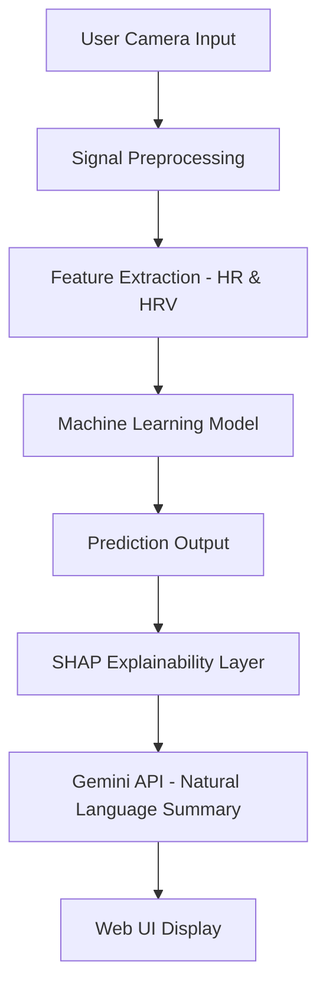

# ❤️ Heart-o-Meter: Web-Based PPG Health Assessment with Explainable AI

## 🌟 Overview
Heart-o-Meter is a non-invasive, web-based health monitoring system that analyzes fingertip Photoplethysmography (PPG) signals captured from a webcam to assess cardiovascular and psychological health.  
It integrates Machine Learning (ML) for disease prediction and Explainable AI (XAI) for clear, trustworthy feedback.

---

## ⚙️ Features
- 🩺 **PPG Signal Acquisition** via webcam (no external sensors needed)  
- 🧠 **ML-Powered Risk Prediction** using Heart Rate (HR) & HRV  
- 💬 **Explainable AI Integration** with SHAP and Gemini  
- 🌐 **Web Dashboard** for live visualization & health summary  
- 🔍 **Non-invasive, Cost-effective, Real-time Monitoring**

---

## 🧩 System Architecture




📁 Project Structure
```
Heart-o-Meter/
│
├── app/                     # Main web application
├── models/                  # Trained ML models
├── static/                  # CSS, JS, Images
├── templates/               # HTML templates
├── utils/                   # Helper functions (signal processing, etc.)
├── requirements.txt          # Python dependencies
├── .gitignore
└── README.md
```
🧠 Technologies Used
Frontend: HTML, CSS, JavaScript

Backend: Flask / FastAPI

ML Frameworks: Scikit-learn, NumPy, Pandas

Explainability: SHAP, Gemini API

Visualization: Matplotlib, Plotly

🚀 How to Run Locally

# 1️⃣ Clone the repo
git clone https://github.com/AnirudhC22/Heart-o-Meter.git
cd Heart-o-Meter

# 2️⃣ Create a virtual environment
python -m venv venv
venv\Scripts\activate  # For Windows

# 3️⃣ Install dependencies
pip install -r requirements.txt

# 4️⃣ Run the application
python app.py
Then open http://localhost:5000 in your browser 🌐

🩸 Sample Output
The system provides real-time heart rate graphs, risk predictions, and AI-generated health summaries.

💡 Future Enhancements
Improve robustness under low light conditions

Expand dataset for diverse demographics

Enable continuous health tracking via web interface

🧾 License
This project is licensed under the MIT License.

✨ Contributors
C.Anirudh — Project Lead

Open for Collaboration ❤️
---
